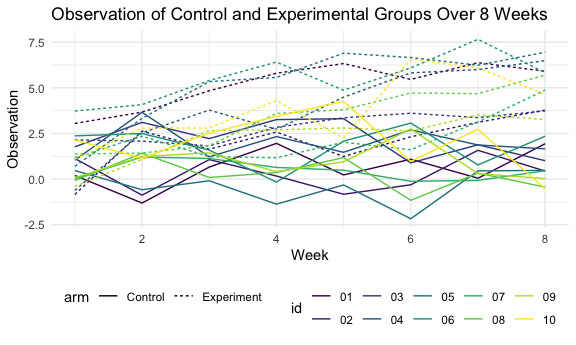

p8105_hw5_jf3355
================
Jiahao Fan
11/19/2021

##Problem 1

``` r
homicide_df = 
  read.csv("homicide-data.csv", na = c("", "Unknown")) %>%
  mutate(
    city_state = str_c(city, state),
    resolution = case_when(
      disposition == "Closed without arrest" ~ "unsolved",
      disposition == "Open/No arrest" ~ "unsolved",
      disposition == "Closed by arrest" ~ "solved")
    ) %>% 
  relocate(city_state) %>% 
  filter(city_state != "TulsaAL")
```

## This dataset has 14 columns and 52178 rows. All variables represent the information about victim.

#Focus on city Baltimore, MD

``` r
baltimore_df = 
  homicide_df %>%
  filter(city_state == "BaltimoreMD")

baltimore_summary = 
  baltimore_df %>%
  summarize(
    unsolved = sum(resolution == "unsolved"),
    n = n()
    )

baltimore_test = 
  prop.test(
    x = baltimore_summary %>% pull(unsolved),
    n = baltimore_summary %>% pull(n))

baltimore_test %>%
  broom::tidy()
```

    ## # A tibble: 1 × 8
    ##   estimate statistic  p.value parameter conf.low conf.high method    alternative
    ##      <dbl>     <dbl>    <dbl>     <int>    <dbl>     <dbl> <chr>     <chr>      
    ## 1    0.646      239. 6.46e-54         1    0.628     0.663 1-sample… two.sided

##All cities

``` r
prop_test_function = function(city_df) {
  
  city_summary = 
  city_df %>%
  summarize(unsolved = sum(resolution == "unsolved"),
            n = n())
  city_test = 
    prop.test(x = city_summary %>% pull(unsolved),
              n = city_summary %>% pull(n))
  return(city_test)
  
}
homicide_df %>%
  filter(city_state == "AlbuquerqueNM") %>%
  prop_test_function()
```

    ## 
    ##  1-sample proportions test with continuity correction
    ## 
    ## data:  city_summary %>% pull(unsolved) out of city_summary %>% pull(n), null probability 0.5
    ## X-squared = 19.114, df = 1, p-value = 1.232e-05
    ## alternative hypothesis: true p is not equal to 0.5
    ## 95 percent confidence interval:
    ##  0.3372604 0.4375766
    ## sample estimates:
    ##         p 
    ## 0.3862434

``` r
results_df = 
  homicide_df %>%
  nest(data = uid:resolution) %>%
  mutate(
    test_results = map(data, prop_test_function),
    tidy_results = map(test_results, broom::tidy)
  ) %>%
  select(city_state, tidy_results) %>%
  unnest(tidy_results) %>%
  select(city_state, estimate, starts_with("conf"))
results_df
```

    ## # A tibble: 50 × 4
    ##    city_state    estimate conf.low conf.high
    ##    <chr>            <dbl>    <dbl>     <dbl>
    ##  1 AlbuquerqueNM    0.386    0.337     0.438
    ##  2 AtlantaGA        0.383    0.353     0.415
    ##  3 BaltimoreMD      0.646    0.628     0.663
    ##  4 Baton RougeLA    0.462    0.414     0.511
    ##  5 BirminghamAL     0.434    0.399     0.469
    ##  6 BostonMA         0.505    0.465     0.545
    ##  7 BuffaloNY        0.612    0.569     0.654
    ##  8 CharlotteNC      0.300    0.266     0.336
    ##  9 ChicagoIL        0.736    0.724     0.747
    ## 10 CincinnatiOH     0.445    0.408     0.483
    ## # … with 40 more rows

#create a plot showing estimates and confidence intervals

``` r
results_df %>%
  mutate(city_state = fct_reorder(city_state, estimate)) %>%
  ggplot(aes(x = city_state, y = estimate)) +
  geom_point() +
  geom_errorbar(aes(ymin = conf.low, ymax = conf.high)) +
  theme(axis.text.x = element_text(angle = 90, vjust = 0.5, hjust = 1))
```


``` r
homicide_df %>%
  group_by(city_state) %>%
  summarize(
    unsolved = sum(resolution == "unsolved"),
    n = n()
  ) %>%
  mutate(
    test_results = map2(unsolved, n, prop.test),
    tidy_results = map(test_results, broom::tidy)
  ) %>%
  select(city_state, tidy_results) %>%
  unnest(tidy_results) %>%
  select(city_state, estimate, starts_with("conf"))
```

    ## # A tibble: 50 × 4
    ##    city_state    estimate conf.low conf.high
    ##    <chr>            <dbl>    <dbl>     <dbl>
    ##  1 AlbuquerqueNM    0.386    0.337     0.438
    ##  2 AtlantaGA        0.383    0.353     0.415
    ##  3 BaltimoreMD      0.646    0.628     0.663
    ##  4 Baton RougeLA    0.462    0.414     0.511
    ##  5 BirminghamAL     0.434    0.399     0.469
    ##  6 BostonMA         0.505    0.465     0.545
    ##  7 BuffaloNY        0.612    0.569     0.654
    ##  8 CharlotteNC      0.300    0.266     0.336
    ##  9 ChicagoIL        0.736    0.724     0.747
    ## 10 CincinnatiOH     0.445    0.408     0.483
    ## # … with 40 more rows

##Problem2 #Create a tidy dataframe containing data from all
participants,including the subject ID, arm, and observations over time:

``` r
file_df = 
  tibble(path = list.files("data")) %>% 
  mutate(data = 
           map(path, ~read.csv(str_c("data/", .x)))) %>% 
  unnest(data)

study_df =
  file_df %>% 
  separate(path, into = c('arm', 'id'), sep = "_") %>%
  mutate(id = str_replace(id,".csv","")) %>% 
  pivot_longer(
    week_1:week_8,
    names_to = "week",
    names_prefix = "week_",
    values_to = "observation"
  ) %>% 
  mutate(
    week = as.integer(week),
    arm = recode(arm, "con"= "Control", "exp" = "Experiment"),
    arm = factor(arm),
    id = factor(id)
  )
study_df
```

    ## # A tibble: 160 × 4
    ##    arm     id     week observation
    ##    <fct>   <fct> <int>       <dbl>
    ##  1 Control 01        1        0.2 
    ##  2 Control 01        2       -1.31
    ##  3 Control 01        3        0.66
    ##  4 Control 01        4        1.96
    ##  5 Control 01        5        0.23
    ##  6 Control 01        6        1.09
    ##  7 Control 01        7        0.05
    ##  8 Control 01        8        1.94
    ##  9 Control 02        1        1.13
    ## 10 Control 02        2       -0.88
    ## # … with 150 more rows

#Make a spaghetti plot showing observations on each subject over time

``` r
study_df %>%
  ggplot(aes(x = week, y = observation, color = id, linetype = arm)) +
  geom_line() + 
  labs(
    title = "Observation of Control and Experimental Groups Over 8 Weeks",
    x = "Week",
    y = "Observation")
```


#Comment: From the plot, we see that there is no significant linear
relationship between them, and after week 7, there is a separation
between them.

##Problem 3

``` r
library(tidyverse)

set.seed(10)

iris_with_missing = iris %>% 
  map_df(~replace(.x, sample(1:150, 20), NA)) %>%
  mutate(Species = as.character(Species))
```

#Write function that takes a vector as an argument

``` r
fill_df = 
  function(x){
    if(is.numeric(x)){
      x = replace_na(x, signif(mean(x, na.rm= TRUE), digits = 2))
    }
    else if(is.character(x)){
      x= replace_na(x,"virginica")
    }
  }
```

# Apply this function to the columns of iris_with_missing using a map statement.

``` r
map_df(iris_with_missing,fill_df)
```

    ## # A tibble: 150 × 5
    ##    Sepal.Length Sepal.Width Petal.Length Petal.Width Species
    ##           <dbl>       <dbl>        <dbl>       <dbl> <chr>  
    ##  1          5.1         3.5          1.4         0.2 setosa 
    ##  2          4.9         3            1.4         0.2 setosa 
    ##  3          4.7         3.2          1.3         0.2 setosa 
    ##  4          4.6         3.1          1.5         1.2 setosa 
    ##  5          5           3.6          1.4         0.2 setosa 
    ##  6          5.4         3.9          1.7         0.4 setosa 
    ##  7          5.8         3.4          1.4         0.3 setosa 
    ##  8          5           3.4          1.5         0.2 setosa 
    ##  9          4.4         2.9          1.4         0.2 setosa 
    ## 10          4.9         3.1          3.8         0.1 setosa 
    ## # … with 140 more rows
